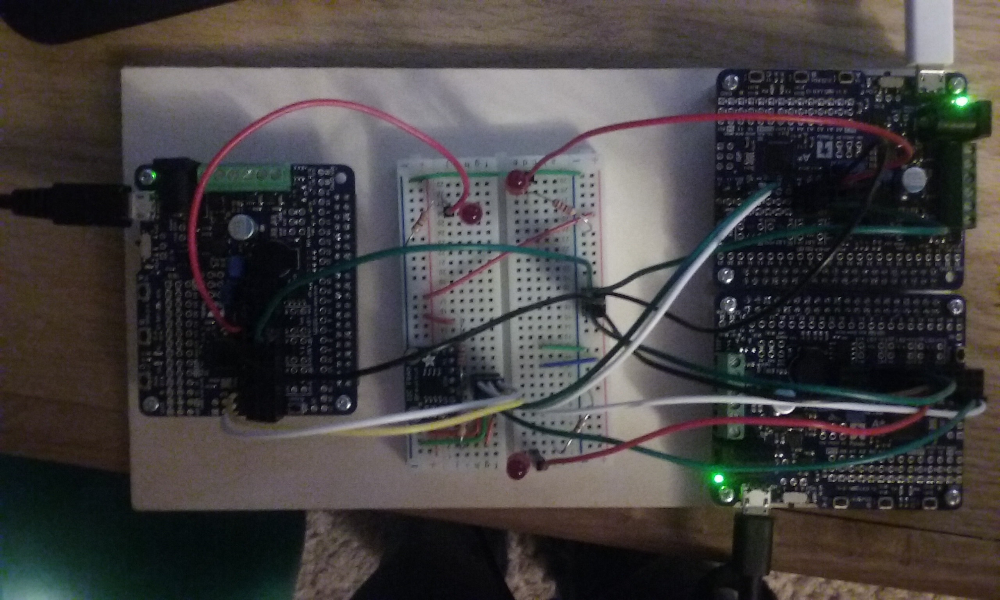

## distributed compression on the AVR platform

This project was supposed to allow for distributed computing between arduinos where the master device has a FRAM chip that allowed for larger problems than a single arduino can do on its own. Load a large block of data onto the FRAM, and then let the device break it up into smaller blocks that would be compressed by other connected arduinos. Initially, a full approximation of zip compression was envisioned as the goal, however, the memory footprint of the Burrows wheeler transform which is the first step in the zip compression algorithm prevented this from being feasible. The simplest implementation of BWT takes n squared space for a sequence of size n since it involves sorting the n different rotations of the input string of bytes, thus requiring an array of n elements of length n+1. This can be reduced with some creative "juggling"; for instance the standard implementation of Bzip2 manages a space complexity of 5n + 1, but this means that a lot more processing goes into the sorting of the rotation arrays. due to the short schedule, and the number of other complex problems present in the project, the compression was simplified to the last step in Bzip2, huffman encoding.

### sources
the i2c_master library is based on the Peter Fleurys library found here:

   http://homepage.hispeed.ch/peterfleury/doxygen/avr-gcc-libraries/group__pfleury__ic2master.html

the i2c_slave library is based on the g4lvanix library found here:

  https://github.com/g4lvanix/I2C-slave-lib

additionally, there is code that was included in the 5143 lab materials including but not limited to the lufa, and LUFA VirtualSerial libraries.

The huffman library was written by project member Pieter van den Ham.

### /huffman/
This is where the huffman transform library was developed and tested. The encoding is made more efficient by limiting the size of the input alphabet to the charactars a-zA-Z?.,;[CR][LF][Space]; the intended test target of the system being compression of written text. The huffman encoding library builds a binary tree to encode the supplied text bytes into a more compact encoding of bits, and in order to enable decoding, serializes the tree, and encodes it using a standardized (non-optimal) tree. The result is significant compression in the order of ~35% reduction for the (admittedly few) tests that were done.

### /main/
this is the image for the controller board. The controller presents a readable/writable device to the host system connected via a usb cable using the LUFA library. The conroller is interfaced via the A and C buttons, a short press on button A puts the system into writable mode, a red light (astar pin9) will turn on, and simply redirecting a bytestream at the device node in /dev will result in the bytes being written into the "input file" on the connected FRAM (via i2c). A long press of button A will reformat the "filesystem", zeroing out the FRAM, and reseting the recorded extents of the two files on the "filesystem". A short press of button C will print out the contents of the output "file", and a long press of button C will begin the process of sending input data from the input file out to worker boards to be processed, either for compression or inflation via the huffman library.

The "filesystem" is accomplished by reserving the first 8 bytes of the FRAM for tracking the extents of the input "file" which begins at byte 8, and the output "file" which begins at byte 16004, thus dividing the remains of the FRAMs 32k bytes in half.

The controller auto senses connected workers, provided that each worker is powered up one-by-one and initialized beforehand. Once the controller has a collection of connected worker boards and data has been loaded into input, it can send data in blocks, either fixed size blocks of raw input for compression or variable length blocks of compressed data for inflation; compressed data blocks are prefixed by the size of the compressed block of data (total size of each block is size bytes +1 for prefix byte). In transmission, an additional byte containing the job code and a sequencing number is prefixed, so that the worker boards can determine whether the sent block should be compressed or inflated, while keeping track of the sequence of the blocks. This makes the entire transmitted block of data two bytes larger than just the block of data which is to be processed.

### /slave/
This is the image for the worker boards. They are self addressing, provided that they are connected and initialized one-by-one. When a  worker is powered on, pressing the A button sets the device into i2c master mode, and it begins scanning for addresses starting at the workers default address of 0x20, and incrementing every time a worker is found. When a unclaimed address is located, the board will switch into slave mode assuming the address that was found to be unclaimed. This was accomplished by writing a i2c_start function which employs a timeout, so that a it can try addresses that may not result in acknowledgement, the resulting error is used to signal that the address is free for use.

### wiring
The wiring is identical for all board, controller or worker alike. The SDA (astar2) and SCL (astar3) pins of all connected boards and the FRAM breakout board are all bonded; this is the i2c bus. Additionally, all the boards and the FRAM breakout board have bonded grounds, and a voltage pin, pb4 (astar8). It may not have been necessary, but the SDA and SCL wires were additionally connected to the i2c voltage pin through resistors, as directed by the i2c section of the Atmel datasheet. For the purposes of user feedback, there is also a red LED attached to PB5 (astar9) on each board. The purpose of the red LED is to signal when the board is ready to read or write, or otherwise signify board activity.

### State of project
Unfortunately I have run out of time on this project. Currently most of the work has been done, but there are some unsettled issues; namely data block sequencing and job completion. I have implemented a system of sequencing the completed data blocks, but the system is untested and while the code now compiles, there are no doubt some logical errors that prevent proper operation, given a few more days I am confident that this project could have been successfully completed.
